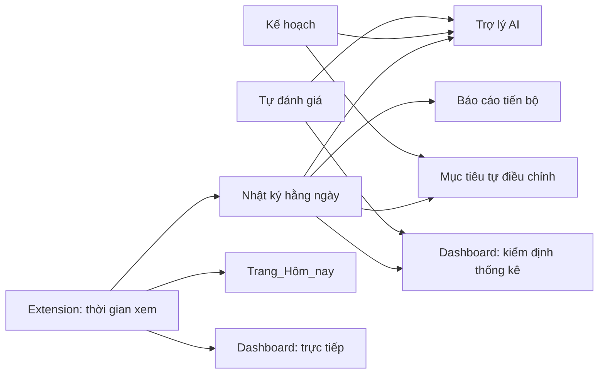

# POP-AI — Giới thiệu các mục, cách dùng và tác dụng

POP-AI là nền tảng hỗ trợ học sinh giảm thói quen xem video ngắn (TikTok / YouTube Shorts / Instagram
Reels / Facebook Reels) và rèn lại khả năng tập trung, dựa trên mô hình 3 giai đoạn:

**Phòng ngừa (Prevent) → Tối ưu hóa (Optimize) → Phát huy (Perform)**

Hệ thống gồm 3 phần chạy song song và "nói chuyện" với nhau qua Firebase:

| Phần | Dành cho | Vai trò |
|---|---|---|
| **Web app** (`index.html`, `app.html`) | Học sinh | Lập kế hoạch, tự đánh giá, ghi nhật ký, xem tiến bộ, chat với Trợ lý AI |
| **Chrome Extension** | Học sinh | Tự động đo thời gian xem video ngắn, không cần tự nhập tay |
| **Teacher dashboard** (`teacher.html`) | Giáo viên | Theo dõi cả lớp, đo hiệu quả can thiệp bằng thống kê |

---

## 1. Đăng nhập (`index.html`)

**Cách dùng:** Chọn tab "Đăng ký" (lần đầu) hoặc "Đăng nhập" (đã có tài khoản) → nếu đăng ký, chọn vai trò
"Tôi là học sinh" hoặc "Tôi là giáo viên" (học sinh có thể nhập luôn mã lớp nếu giáo viên đã cho, giáo
viên phải nhập mã xác thực) → nhập email + mật khẩu → bấm nút.

**Tác dụng:** Xác thực bằng email + mật khẩu tự đặt (Firebase Authentication), đồng thời xin sự đồng ý
của người dùng về việc lưu dữ liệu tự đánh giá / nhật ký / thời gian xem video ngắn — nêu rõ dữ liệu phục
vụ theo dõi cá nhân và nghiên cứu giáo dục, **không dùng để chẩn đoán y khoa**. Dùng đúng một email/mật
khẩu ở cả web app và Chrome Extension để dữ liệu hai bên khớp vào cùng một tài khoản.

---

## 2. Trang Hôm nay (`page-today`)

**Cách dùng:** Đây là màn hình mặc định sau khi đăng nhập, không cần thao tác gì thêm.

**Tính năng & tác dụng:**
- **Chuỗi ngày liên tục, phút video ngắn hôm nay, số phiên tập trung** — 3 con số tổng quan giúp học
  sinh nhìn thấy ngay tình trạng hôm nay, không phải lục lại từng mục.
- **Thẻ "POP-AI đề xuất" (mục tiêu tự điều chỉnh)** — chỉ hiện khi hệ thống phát hiện học sinh đã ổn định
  dưới/trên mục tiêu hiện tại trong vài ngày gần nhất, và đề xuất một mục tiêu mới sát thực tế hơn (xem
  chi tiết ở mục 8). Học sinh có thể **Đồng ý** (áp dụng mục tiêu mới) hoặc **Giữ nguyên**.
- **Tiến trình 7 ngày** — thanh tiến độ đơn giản cho thấy đã hoàn thành nhật ký bao nhiêu ngày trong tuần
  hiện tại, tạo động lực duy trì streak.

---

## 3. Giai đoạn Phòng ngừa (`page-prevent`)

### 3.1. Tab "Tìm hiểu Popcorn Brain"
**Tác dụng:** Bài học ngắn giải thích khái niệm "Popcorn Brain" — não bộ quen nhịp kích thích nhanh từ
video ngắn — biểu hiện, tác động tới học tập, và cách phòng tránh. Đây là bước giáo dục nhận thức trước
khi học sinh làm bài tự đánh giá, giúp các em hiểu **vì sao** cần thay đổi trước khi đo lường mức độ.

### 3.2. Tab "Tự đánh giá nguy cơ"
**Cách dùng:** Trả lời bộ câu hỏi trắc nghiệm → bấm "Xem kết quả".

**Tác dụng:** Tính ra điểm tổng (thang 0–50) và phân loại mức nguy cơ:
- **0–20: Thấp** · **21–35: Trung bình** · **36–50: Cao**

Kết quả này được lưu vào Firestore (`assessments/{uid}/entries`) và dùng làm:
- **Điểm nền (baseline)** ở lần tự đánh giá đầu tiên, và **điểm cuối chương trình** khi đánh giá lại —
  hai điểm này là dữ liệu ghép cặp để giáo viên chạy kiểm định thống kê ở dashboard (mục 9).
- Ngữ cảnh cho Trợ lý AI khi tư vấn (mục 7).

> Lưu ý: đây là công cụ **giáo dục**, không phải công cụ chẩn đoán y khoa/tâm lý — điều này được nhắc lại
> ngay trên giao diện.

---

## 4. Giai đoạn Tối ưu hóa (`page-optimize`)

### 4.1. Tab "Kế hoạch"
**Cách dùng:** Điền các trường: thời gian xem video ngắn hiện tại, mục tiêu muốn giảm xuống, khung giờ
không dùng điện thoại, độ dài + số phiên tập trung mỗi ngày, và nhiệm vụ học tập quan trọng nhất → bấm
"Lưu kế hoạch".

**Tác dụng:** Đây là "hợp đồng cam kết" của học sinh với chính mình, lưu vào Firestore (`plans/{uid}`).
Dữ liệu này được dùng ở khắp nơi trong app: hiển thị ở trang Hôm nay, làm ngữ cảnh cho Trợ lý AI, và làm
mốc so sánh cho mục tiêu tự điều chỉnh (mục 8). Kế hoạch có thể sửa lại bất cứ lúc nào — hệ thống chủ động
nhắc "đừng đặt mục tiêu quá cao ngay từ đầu" để tránh học sinh bỏ cuộc sớm.

### 4.2. Tab "Đồng hồ tập trung"
**Cách dùng:** Tick checklist chuẩn bị (tắt thông báo, để điện thoại xa, chuẩn bị tài liệu, đóng app
không liên quan) → ghi nhiệm vụ đang làm → chọn thời lượng (15/20/25/30 phút) → bấm "Bắt đầu".

**Tác dụng:** Là kỹ thuật Pomodoro rút gọn, cụ thể hóa nguyên tắc "phiên tập trung ngắn dần tăng lên" đã
học ở mục Phòng ngừa. Mỗi phiên hoàn thành được đếm lại (hiển thị "Phiên đã hoàn thành hôm nay") và cộng
vào số liệu ngày hôm đó — dùng để tính "phiên tập trung TB" trên dashboard giáo viên.

---

## 5. Giai đoạn Phát huy (`page-perform`)

### 5.1. Tab "Nhật ký hôm nay"
**Cách dùng:** Cuối ngày, điền: phút xem video ngắn, số phiên/tổng thời gian tập trung đã hoàn thành, số
lần bị gián đoạn, mức hoàn thành nhiệm vụ (1–5), cảm nhận về khả năng tập trung (1–5), một điều làm tốt,
một điều cần điều chỉnh ngày mai → "Lưu nhật ký hôm nay".

**Tác dụng:** Đây là nguồn dữ liệu **định lượng lẫn định tính** quan trọng nhất của toàn hệ thống —
`journals/{uid}/entries/{ngày}`. Nó nuôi cho:
- Biểu đồ báo cáo tiến bộ (mục 5.2)
- Ngữ cảnh cá nhân hóa của Trợ lý AI (mục 7)
- Thuật toán mục tiêu tự điều chỉnh (mục 8)
- Chuỗi ngày liên tục ở trang Hôm nay

### 5.2. Tab "Báo cáo tiến bộ"
**Tác dụng:** Hai biểu đồ (video ngắn & thời gian tập trung theo ngày, vẽ bằng Chart.js) cho học sinh
**thấy bằng mắt** xu hướng của chính mình theo thời gian, kèm một dòng nhận xét ngắn dựa trên số liệu thật
(cần đủ dữ liệu 7 ngày). Mục đích là củng cố động lực bằng bằng chứng cụ thể, thay vì cảm giác mơ hồ
"hình như mình có tiến bộ".

---

## 6. Trợ lý POP-AI (`page-assistant`)

**Cách dùng:** Gõ câu hỏi/tâm sự vào ô chat, bấm Gửi (hoặc Enter).

**Tác dụng:** Đây là một chatbot AI **thật** (không phải kịch bản trả lời cố định). Trước khi trả lời,
hệ thống tự đọc kế hoạch, nhật ký 7 ngày gần nhất, lần tự đánh giá gần nhất và thời gian xem video ngắn
hôm nay của **đúng học sinh đang chat**, đưa vào làm ngữ cảnh cho mô hình AI — nên câu trả lời bám sát
tình huống thật của từng em (VD: "3 ngày liên tiếp em vượt mục tiêu vào buổi tối, thử đổi giờ học sang
sáng sớm xem sao") thay vì lời khuyên chung chung. Trợ lý được lập trình để: khích lệ chứ không phán xét,
đưa tối đa 1–2 gợi ý hành động cụ thể mỗi lần, và không đưa chẩn đoán y khoa/tâm lý. Lịch sử hội thoại
được lưu lại (Realtime Database) để giữ mạch chuyện cho những lần chat sau.

---

## 7. Cài đặt (`page-settings`)

**Tính năng & tác dụng:**
- **Trạng thái kết nối tiện ích trình duyệt** — cho biết Chrome Extension đã đồng bộ dữ liệu vào tài
  khoản này chưa; nếu chưa, hướng dẫn cài đặt và đăng nhập cùng email + mật khẩu.
- **Tham gia lớp** — nhập mã lớp giáo viên cung cấp để giáo viên nhìn thấy tiến trình của mình (ẩn danh
  qua mã học sinh).
- **Mã học sinh của bạn** — mã định danh (VD: `HS-4K9P`) dùng thay tên thật khi hiển thị trên dashboard
  giáo viên, bảo vệ quyền riêng tư.

---

## 8. Mục tiêu tự điều chỉnh (adaptive goal-setting)

Đây không phải một trang riêng mà là một **cơ chế chạy ngầm**, hiện kết quả ở thẻ "POP-AI đề xuất" trên
trang Hôm nay (mục 2).

**Tác dụng:** Nhìn vào nhật ký 2–3 ngày gần nhất, hệ thống so sánh hành vi thực tế với mục tiêu học sinh
đã đặt:
- Nếu học sinh đã **ổn định dưới mục tiêu** một thời gian → đề xuất hạ mục tiêu xuống thấp hơn nữa (tăng
  độ khó dần, tránh mục tiêu cũ trở nên quá dễ và mất tác dụng thúc đẩy).
- Nếu học sinh **liên tục không đạt được mục tiêu hiện tại** → đề xuất một mục tiêu sát thực tế hơn, để
  tránh cảm giác thất bại lặp lại làm nản chí.

Học sinh luôn có quyền quyết định cuối cùng (Đồng ý / Giữ nguyên) — hệ thống chỉ gợi ý dựa trên bằng
chứng, không tự động thay đổi kế hoạch.

---

## 9. Chrome Extension (POP-AI Tracker)

**Cách dùng:** Cài extension (Load unpacked hoặc từ Chrome Web Store) → tick đồng ý điều khoản → đăng
nhập/đăng ký ngay trong popup bằng **cùng email + mật khẩu** dùng ở web app.

**Tính năng & tác dụng:**
- **Đo tự động** thời gian xem trên các nền tảng video ngắn (YouTube Shorts, TikTok, Instagram/Facebook
  Reels) khi tab đang active, đồng bộ mỗi phút vào Firestore — học sinh không cần tự bấm giờ hay nhập tay,
  giảm sai số và giảm gánh nặng ghi chép.
- **Popup tiện ích** — hiện nhanh số phút video ngắn đã xem hôm nay ngay trên thanh công cụ trình duyệt,
  không cần mở web app.
- **Friction nudge (lớp phủ nhắc nhở)** — khi vượt ngưỡng thời gian đã đặt, hiện một lớp phủ mờ **không
  chặn cứng trang** hỏi học sinh có muốn dừng lại không, kèm 3 lối thoát rõ ràng: đóng lại, xem thêm 10
  phút (snooze), hoặc mở thẳng Đồng hồ tập trung trong web app. Đây là "ma sát hành vi" nhẹ nhàng — nhắc
  chứ không cấm — tôn trọng quyền tự quyết của học sinh.
- **Trạng thái trực tiếp (`liveStatus`)** — ghi nhận mỗi phút học sinh có đang ở nền tảng giải trí hay
  không, để giáo viên xem lớp đang "ở đâu" theo thời gian thực (mục 10). Extension **không** ghi lại URL
  cụ thể của các trang không phải giải trí, để bảo vệ quyền riêng tư khi lướt web bình thường.

---

## 10. Teacher Dashboard (`teacher.html`)

**Cách dùng:** Đăng nhập với vai trò giáo viên → chọn lớp (hoặc "+ Tạo lớp mới") → chia sẻ mã lớp hiển
thị ở đầu trang cho học sinh nhập vào mục Cài đặt.

**Tính năng & tác dụng:**
- **4 chỉ số tổng quan** — số học sinh tham gia, số đã tự đánh giá, % hoàn thành nhật ký 7 ngày, số phiên
  tập trung trung bình — cho cái nhìn nhanh về mức độ tham gia của cả lớp.
- **"Đang diễn ra trong lớp" (trực tiếp)** — bảng tự cập nhật (không cần tải lại trang, dùng
  `onSnapshot`) hiện học sinh nào đang xem nền tảng giải trí nào ngay lúc này, giúp giáo viên can thiệp
  kịp thời trong giờ học nếu cần, mà không xâm phạm quyền riêng tư (chỉ hiện nền tảng giải trí, không hiện
  URL các trang khác).
- **Kiểm định hiệu quả can thiệp** — công cụ nghiên cứu nghiêm túc nhất của dashboard: so sánh số liệu
  **trước và sau** trên cùng một nhóm học sinh (thiết kế ghép cặp, pre–post) cho 2 loại kết quả (thời
  gian video ngắn, điểm tự đánh giá nguy cơ). Chạy song song:
  - **t-test ghép cặp** (tham số) — kèm Cohen's dz, Hedges' g và khoảng tin cậy 95%.
  - **Wilcoxon signed-rank** (phi tham số) — kèm effect size r, dùng exact test khi mẫu nhỏ/không hạng
    trùng, xấp xỉ chuẩn khi mẫu lớn.
  - Hệ thống tự **gợi ý nên đọc kết quả kiểm định nào** dựa trên cỡ mẫu và độ lệch phân phối, giúp giáo
    viên không cần rành thống kê sâu vẫn đọc đúng kết luận — rất hữu ích nếu dashboard này phục vụ báo
    cáo nghiên cứu/sáng kiến kinh nghiệm.
- **Bảng theo dõi tiến trình học sinh** — từng học sinh (theo mã, không hiện tên) với mức nguy cơ, video
  ngắn đầu→hiện tại, số phiên tập trung, số lần gián đoạn, số ngày hoàn thành, điểm cuối chương trình.
- **Xuất dữ liệu (.xlsx)** — tải toàn bộ bảng trên về file Excel, phục vụ lưu trữ, báo cáo, hoặc phân
  tích sâu hơn ngoài dashboard.

---

## Tóm tắt luồng dữ liệu (ai nuôi mục nào)

Nói ngắn gọn: **Extension đo hành vi tự động → học sinh phản tư qua nhật ký/tự đánh giá → hệ thống dùng
chính dữ liệu đó để cá nhân hóa lời khuyên (Trợ lý AI, mục tiêu tự điều chỉnh) và để giáo viên đo hiệu quả
can thiệp bằng thống kê** — một vòng lặp khép kín giữa hành vi thật, phản tư và can thiệp có bằng chứng.
